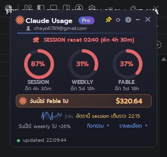

# Claude Usage Widget (Windows)

Desktop widget แสดงโควต้า Claude plan (session / weekly / per-model) บน Windows —
exe ไฟล์เดียว ~30 KB ไม่ต้องติดตั้งอะไรเพิ่ม กิน RAM ~40 MB

ได้แรงบันดาลใจจาก [claude-usage-widget](https://github.com/PanithanNanti/claude-usage-widget) (macOS/Übersicht)
— ตัวนี้เขียนใหม่ทั้งหมดสำหรับ Windows



## ฟีเจอร์

- Progress bar ทุก limit ที่ plan มี (session / weekly / per-model) พร้อม **Pace coloring**:
  ขีดขาวบนบาร์ = ตำแหน่งเวลาที่ผ่านไปของ window — ถ้าแถบสีวิ่งแซงขีดขาวแปลว่าใช้เร็วกว่า
  เวลา สีจะเตือนเป็นเหลือง/แดงแม้ % ยังต่ำ (เขียว = ใช้ช้ากว่าเวลา สบายๆ)
- **โหมดจิ๋ว (pill)** — ดับเบิลคลิกที่ widget ย่อเหลือแคปซูล S/W % เล็กๆ ดับเบิลคลิกอีกทีขยายกลับ
- **คลิกที่ sparkline** เพื่อกาง **Token Activity heatmap** 26 สัปดาห์ (สไตล์ GitHub/Codex)
  พร้อมโปรเจกต์ที่ใช้หนักสุดใน 7 วันและวันนี้
- **มูลค่า $ ที่ใช้วันนี้** เทียบราคา API (ในปุ่มรายละเอียด) — โชว์ความคุ้มของ plan
- **แจ้งเตือนกลับด้าน**: weekly เหลือเกินครึ่งและจะ reset ใน 24 ชม. → เตือน "ใช้ให้คุ้มก่อนหาย"
- **Streak** — ใช้งานติดต่อกันกี่วัน โชว์ไฟ ×N ข้างๆ pets
- **แจ้งเตือนเฉพาะตอนใกล้เต็ม** (75% และ 90%) — เต็มแล้วไม่เด้งกวน และเลือก**โทน**ได้ 4 ระดับ:
  ทางการ / เป็นมิตร / ขี้เล่น / เกรียน 🔥 (เมนู tray → โทนแจ้งเตือน)
- **Pet เป็นรูปของคุณเองได้ (รูปเดียวพอ)** — tray → Pets → เลือกรูป widget ปรับอารมณ์ให้
  อัตโนมัติตาม limit: ปกติ / เหงื่อหยด+โยกเร็ว (60%+) / ติดโทนแดง+สั่น (85%+)
  รูป**เกาะขอบบนนอกการ์ด** (หน้าต่างโปร่งใสแยกที่เกาะติด widget) และถูก copy เก็บถาวรใน
  `%LOCALAPPDATA%\ClaudeUsageWidget\pet\` — ปิดเครื่อง/ลบไฟล์ต้นฉบับก็ไม่หาย
- **Headline พยากรณ์ reset** ใต้ชื่อแอป: "⛈ SESSION reset 22:19 (อีก 4h 18m)" บอกทั้ง
  เวลานาฬิกาและนับถอยหลัง ไอคอนสภาพอากาศเปลี่ยนตาม pace (☀ ชิล / ⛅ เร็ว / ⛈ เผาหนัก)
- **แสดงบัญชีที่กำลังใช้** — อีเมลบนหัว widget (ดึงจาก `~\.claude.json`) สลับบัญชีแล้วรู้ทันที
  ว่าตอนนี้ live ด้วยบัญชีไหน + ป้าย "หลายบัญชี" เมื่อมีบัญชีเสริม
- **รีเฟรชทันทีเมื่อถึงเวลา reset** — บาร์ไม่ค้างที่ 100% เกินเวลา reset แม้จะติด 429 backoff อยู่
- โลโก้ Claude spark วาดด้วยโค้ด (unofficial — ไม่มีส่วนเกี่ยวข้องกับ Anthropic)
- **ปัจจัยการใช้งาน 7 วัน** ใน panel กิจกรรม — % จาก context ใหญ่ (>150k), % จาก
  subagents, skills ที่ใช้บ่อยเป็น % (สไตล์หน้า /usage ของ Claude Code)
- **Hover บน heatmap** เพื่อดูวันที่ + จำนวน token ของแต่ละวัน
- **2 ภาษา ไทย/English** (เมนู tray → ภาษา) และใช้ฟอนต์ **Prompt** อัตโนมัติถ้าติดตั้งไว้
- ป้าย plan อัตโนมัติ (Pro / Max / Team)
- นับถอยหลังถึงเวลา reset ของแต่ละ limit
- แจ้งเตือน Windows เมื่อ limit แตะ 80% และ 95% (เตือนครั้งเดียวต่อรอบ reset)
- พยากรณ์ burn rate: "อัตรานี้ session เต็มราว 14:30"
- Sparkline การใช้ session ย้อนหลัง 24 ชม.
- **Near-realtime**: เฝ้าไฟล์ activity ของ Claude Code (`~\.claude\projects\*.jsonl`) —
  ระหว่างใช้งานจริง refresh ทุก ~30-60 วินาที (status ขึ้น "live") พอเครื่องว่างถอยเป็นทุก 10 นาที
- สถิติรายวัน: "วันนี้ใช้ weekly ไป +X%" คำนวณจาก history ในเครื่อง
- **Pixel pets 3 ตัว** — Capybara (มีส้มยูซุบนหัว), แมวส้ม, เป็ด — เลือกโชว์กี่ตัวก็ได้จาก
  เมนู tray (คลิกขวา → Pets) วาดด้วยโค้ดล้วน ไม่ใช้ asset ภายนอก และอารมณ์เปลี่ยนตาม usage
  จริง: ชิลเมื่อต่ำกว่า 60%, เหงื่อแตกเมื่อแตะ 60%, สั่น+เหงื่อสองเม็ดเมื่อเกิน 85%
- **ปุ่ม "รายละเอียด"** — เจาะลึกการใช้งานวันนี้จาก transcripts ในเครื่อง (อ่านอย่างเดียว
  ไม่ส่งออกไปไหน): token in/out/cache, จำนวน sessions, skills ที่เรียกใช้, โปรเจกต์ที่กิน token สูงสุด
- **หลายบัญชี** — ง่ายสุด: **ลากไฟล์ `.credentials.json` มาวางบน widget** หรือคลิกขวา tray →
  Accounts → สแกน WSL อัตโนมัติ / เลือกไฟล์เอง แสดงเป็น section ซ้อนใน widget เดียว
  (ตัวเลข limit รวม claude.ai chat อยู่แล้ว เพราะโควต้า plan เป็นของทั้งบัญชี ไม่แยก chat/Code)
- **สลับบัญชีได้จริง** — Accounts → "สลับใช้: …" คัดลอก credentials เข้า `~\.claude`
  (สำรองไฟล์เดิม + เก็บ token ล่าสุดของบัญชีเก่ากลับ slot ก่อนเสมอ) เซสชัน Claude Code
  ใหม่ใช้บัญชีนั้นทันที และมี "เพิ่มบัญชีใหม่ (login ผ่านเบราว์เซอร์)" ที่เปิด Claude Code
  ใน `CLAUDE_CONFIG_DIR` แยก — auth จริงโดยไม่ต้องฝัง OAuth เอง
- แจ้งเตือนเมื่อบัญชีหลักใกล้เต็มแต่บัญชีเสริมยังว่าง → สลับได้จากเมนู
- ปุ่มบน widget: 📌 ปักหมุด · ⟳ รีเฟรช · ⚙ ตั้งค่า (เมนูเดียวกับ tray) · — ย่อเป็น pill bar
  (กด ⛶ หรือดับเบิลคลิกเพื่อขยายกลับ) · ✕ ปิดแอป
- Tray icon แสดงระดับสูงสุดพร้อมเปลี่ยนสี, ดับเบิลคลิกเพื่อซ่อน/แสดง
- ปักหมุด always-on-top ได้, ลากวางตำแหน่งได้ (จำตำแหน่งไว้)
- ตั้ง Start with Windows ได้จากเมนูคลิกขวาที่ tray icon
- กันโดน rate limit: เว้นอย่างน้อย 30 วิระหว่าง fetch + backoff 15 นาทีเมื่อเจอ 429

## ติดตั้ง / Build เอง (แนะนำ)

ต้องมี [Claude Code](https://claude.com/claude-code) ติดตั้งและ login แล้ว (widget ใช้ token ของ Claude Code)

```
git clone https://github.com/<you>/claude-usage-widget-win
cd claude-usage-widget-win
build.cmd
ClaudeUsageWidget.exe
```

`build.cmd` ใช้ `csc.exe` ที่ฝังมากับ Windows ทุกเครื่อง — ไม่ต้องลง SDK หรือ Visual Studio
build เองจาก source ได้ใน 2 วินาที จึงตรวจสอบได้ว่าโค้ดทำอะไรกับ token ของคุณบ้าง

ไอคอนแอป (`app.ico`) ถูก commit ไว้แล้วและฝังเข้า exe อัตโนมัติตอน build อยากแก้ไอคอนเอง
ก็แก้ `makeicon.cs` แล้วรัน `csc makeicon.cs && makeicon.exe` เพื่อสร้าง `app.ico` ใหม่

## ความปลอดภัยของ token

- อ่าน `%USERPROFILE%\.claude\.credentials.json` แบบ **read-only** ไม่มีการเขียนทับ
- token ถูกส่งไปที่ `api.anthropic.com` **เท่านั้น** ไม่มี host อื่น ไม่มี telemetry
- ไม่ทำ refresh token เอง (กันชนกับ Claude Code) — ถ้า token หมดอายุ widget จะบอกให้เปิด Claude Code สักครั้ง แล้วอ่านไฟล์ใหม่เอง
- ตรวจสอบได้ทั้งหมดใน `Program.cs` ไฟล์เดียว

## หมายเหตุ

- ใช้ endpoint ภายใน `api.anthropic.com/api/oauth/usage` (ตัวเดียวกับคำสั่ง `/usage`
  ของ Claude Code) ซึ่งไม่ใช่ API ทางการ — schema อาจเปลี่ยนได้ widget จึง parse
  เฉพาะ `limits[]` และออกแบบให้ field ที่หายไปแค่ไม่แสดง ไม่ crash
- ข้อมูล history เก็บที่ `%LOCALAPPDATA%\ClaudeUsageWidget\history.csv` (ในเครื่องเท่านั้น)
- ทดสอบการเชื่อมต่อแบบ command line: build ด้วย `/target:exe` แล้วรัน `--selftest`

## English (short)

Windows desktop widget for Claude plan usage limits. Single ~30 KB exe, no runtime
to install (builds with the `csc.exe` bundled in every Windows 10/11). Reads the
Claude Code OAuth token read-only from `~\.claude\.credentials.json`, polls the
same internal endpoint Claude Code's `/usage` uses, and shows progress bars,
reset countdowns, burn-rate ETA, toast alerts at 80/95%, a tray icon, and a 24h
sparkline. The token never leaves your machine except to `api.anthropic.com`.

License: MIT
